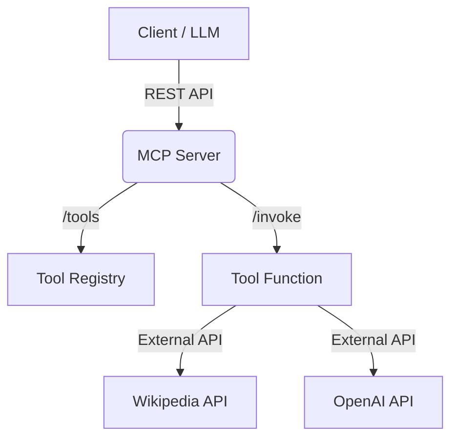

# MCP Server

Minimal Python server for Model Context Protocol (MCP) tool invocation and agent prototyping.

## Quickstart


## Why Uvicorn?

Uvicorn is a lightning-fast ASGI server for Python web applications. It is used to run FastAPI apps in production and development, providing high performance and support for async features. This project uses Uvicorn to serve the MCP server.
> **Note:**
> Uvicorn is used because it is a fast, production-ready server for running FastAPI apps, supporting async features and high concurrency.

### Install Uvicorn

If not already installed, add it with pip:
```bash
pip install uvicorn
```

## Quickstart

1. Install dependencies:
   ```bash
   pip install -r requirements.txt
   ```
2. Run the server:
   ```bash
   uvicorn app.main:app --reload
   ```

## API Endpoints

- `GET /tools` — List available tools
- `POST /invoke` — Invoke a tool with arguments

## Example Usage

```bash
curl -X POST http://localhost:8000/invoke -H "Content-Type: application/json" -d '{"tool": "wikipedia_person", "arguments": {"name": "Albert Einstein"}}'
```

## Architecture



## License
MIT
